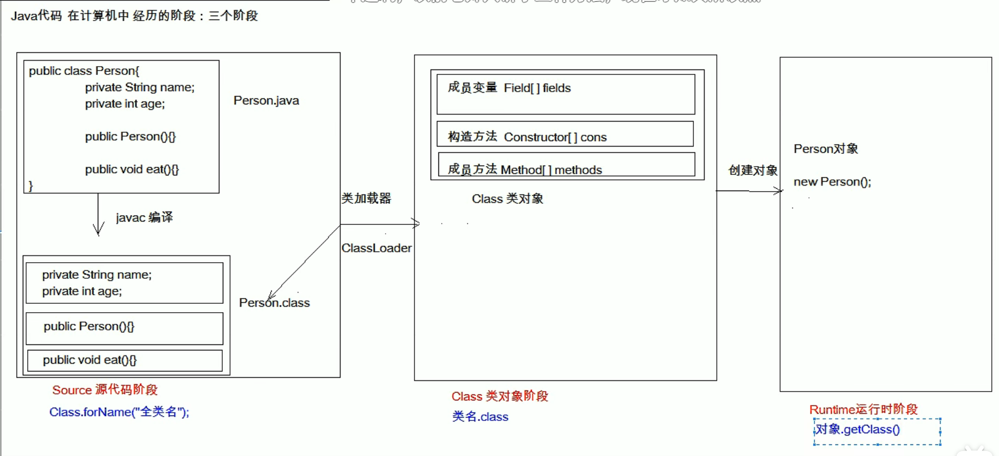

# JAVA

## Junit单元测试

### 测试分类

- 黑盒测试:不需要写代码
- 白盒测试:需要写代码,关注程序具体的执行测试

>Junit是白盒测试

### Junit测试步骤

1. 定义一个测试类(测试用例)
   - 建议
     - 测试类名：被测试的类名Test    CalculatorTest
     - 包名：xxx.xxx.xx.test     cn.incast.test

2. 定义测试方法:可以独立运行
   - 建议
     - 方法名：test测试的方法名      testAdd()
     - 返回值：void
     - 参数列表：空参

3. 给方法加@Test
4. 导入Junit依赖环境

### 判定结果

- 红色：失败
- 绿色：成功
- 一般是我们使用断言操作来处理结果
  - `Assert.assertEquals(excepted,result);`

### 补充

- @Before
  - 修饰的方法会在测试方法之前被自动执行
- @After
  - 修饰的方法会在测试方法执行之后被自动执行

## 反射：框架设计的灵魂

- 框架：半成品软件。可以在框架的基础上进行软件开发，简化编码
- 反射：将类的各个组成部分封装成其他对象，这就是反射机制
  - 好处：
    1. 可以在程序运行过程中，操作这些对象
    2. 可以解耦，提高程序的可拓展性



### Class对象的获取方式

1. `Class.forname("全类名")`：包名+类名  将字节码文件加载进内存，返回class对象
   - 多用于配置文件，将类名定义在配置文件中，读取文件，加载类
2. 类名.class:通过类名的属性class获取
   - 多用于参数的传递
3. 对象.getClass():getClass()方法在Object类中定义着。
   - 多用于对象的获取字节码的方式

> 同一个字节码文件(.class)在一次程序运行中，只会被加载一次，不论通过哪一种方式获取的Class对象都是同一个

### Class对象功能

- 获取功能：
    1. 获取成员变量们

        ```java
        Field[] getFields()   :获取所有public修饰的成员变量
        Field getField(String name)    :获取指定名字的public修饰的成员变量
        Field getDeclaredFields() :获取所有的成员变量，不考虑修饰符（可以获取私有变量，不过要忽略访问权限修饰符的安全检查--field.setAccesible(true);//暴力反射）
        Field getDeclaredField(String name)
        ```

    2. 获取构造函数们

        ```java
        Constructor<?>[] getConstructors()
        Constructor<T> getConstructor(类<?>... parameterTypes)
        Constructor<T> getDeclaredConstructor(类<?>... parameterTypes)
        Constructor<?>[] getDeclaredConstructors()
        ```

    3. 获取成员方法们

        ```java
        Method[] getMethods()
        Method getDeclaredMethod(String name, 类<?>... parameterTypes)
        Method[] getDeclaredMethods()
        Method getDeclaredMethod(String name, 类<?>... parameterTypes)
        ```

    4. 获取类名
        `String getname(); //全类名`

### Field：成员变量

- 操作
  1. 设置值
      - void set(Object obj, Object value)
  2. 获取值
      - get(Object obj)
  3. 忽略访问权限修饰符的安全检查
      - field.setAccesible(true)l;//暴力反射

### Constructor：构造方法

- 创建对象：
  - T newInstance(Object... initargs)
  - 如果使用空参构造方法创建对象，操作可以简化：class对象的newInstance
  - 忽略访问权限修饰符的安全检查
    - field.setAccesible(true)l;//暴力反射

### Method：成员方法

- 执行方法：
  - Object invoke(Object obj, Object.. args)
  - 忽略访问权限修饰符的安全检查
    - field.setAccesible(true)l;//暴力反射
- 获取方法名称：
  - String getName：获取方法名

### 案例

- 需求：写一个“框架”，在不改变该类的任何代码的前提下，可以帮助我们创建任意类的对象，并且执行其中任意的方法
  - 实现：
    1. 配置文件
    2. 反射
  - 步骤：
    1. 将需要创建的对象的全类名和需要执行的方法定义在配置文件(.properties)中
    2. 在程序中加载读取配置文件
    3. 使用反射技术来加载类文件进内存
    4. 创建对象
    5. 执行方法

## 注解

- 概念:也叫元数据，一种代码级别的说明。JDK1.5之后  @注解名称
- 作用分类：
  - 编写文档：通过注解生成文档
  - 代码分析：通过注解对代码进行分析（使用反射）
  - 编译检查：通过注解让编译器实现基本的编译检查（Override）

### JDK预定义的一些注解

- @Override：检测被该注解标注的方法是否继承自父类（接口）
- @Deprecated：将该注解标注的内容，表示已过时
- @SuppressWarnings：压制警告
  - 一般传递参数＂all＂    @SuppressWarning(＂all")

### 自定义的注解

- 格式：
  - 元注解
  - public @interface 注解名称{}
- 本质：注解本质上就是一个接口，默认继承继承Annotation接口
  - public interface MyAnno extends java.lang.annotation.Annotation{}
- 属性：接口中可以定义的**成员方法**
  - 要求：
    1. 属性的返回值类型
       1. 基本数据类型
       2. String
       3. 枚举
       4. 注解
       5. 以上类型的数组
    2. 定义了属性，在使用时需要给属性**赋值**（类似于成员变量那样赋值）
       1. 如果定义属性时，使用default关键字给属性默认初始化值，则使用注解时，可以不进行属性的赋值。
       2. 如果只有一个属性需要赋值，并且属性的名称是value，则value可以省略，直接定义值即可
       3. 数组赋值时，使用{}包裹。如果数组只有一个值，则{}可以省略

- 元注解：用于描述注解的注解
  - @Target：描述注解能够作用的位置
    - ElementType取值：（不止以下几种）
      - TYPE：可以作用与类上
      - METHOD：可以作用于方法上
      - FILED：可以作用于成员变量上
  - @Retention：描述注解被保留的阶段
    - @Retention(RetentionPolicy.RUNTIME)：当前描述的注解，会保留到class字节码文件中，并被JVM读取到
  - @Documented：描述注解是否被抽取到api文件中
  - @Inherited：描述注解是否被子类继承

### 在程序中使用（解析）注解：获取注解中定义的属性的值

1. 获取注解定义的位置的对象（Class、Method、Field）
2. 获取指定的注解
  getAnnotation(Class)
  // 其实就是在内存中生成了一个该注解接口的子类实现对象

    ```java
    /*
    public Class ProImpl implements Pro {
        public String className()
        {
            return "cn.itcast.annotation.Demo1";
        }
        public String methodName()
        {
            return "show";
        }
    }
      */
    ```

3. 调用注解中的抽象方法获取配置的属性值

### 小结

1. 以后大多数时候，我们会使用注解，而不是自定义注解
2. 注解给谁用？
   1. 编译器
   2. 解析程序

3. 注解不是程序的一部分，可以理解为注解就是一个标签
