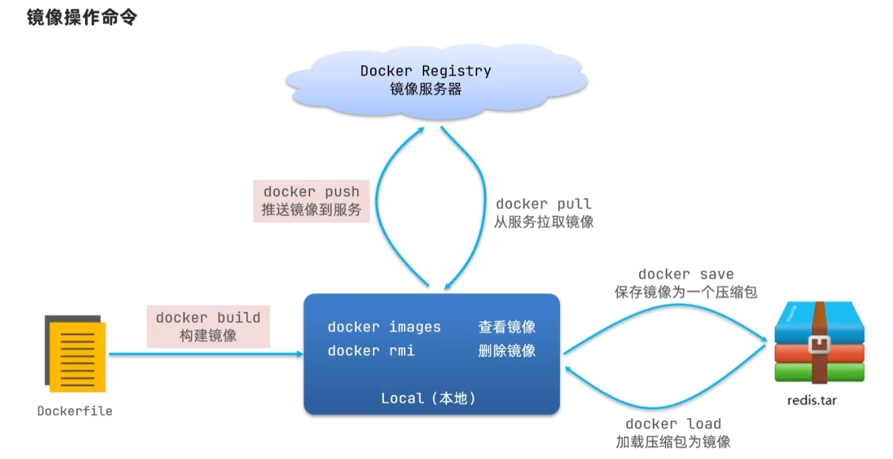
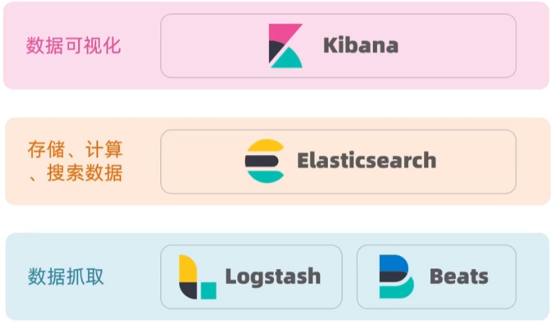

# 微服务

## 分布式架构

- 微服务架构是分布式架构中的一种，但是拆分得更加细化

## 微服务技术对比

## 注册中心

### 服务注册与发现

- spring cloud规范了服务注册与发现的接口，因此切换注册中心时，消费者代码不需要改变
- 服务注册：配置好注册中心以及引入对应依赖即可
- 服务拉取：使用服务名称代替服务端口号(RestTemplate)

### 远程调用

- 用于微服务之间互相调用
- RestTemplate类
  - 需要显性的url去调用
- Feign(同步)
  - 声明式的http客户端
  - 和SpringMVC使用方法类似
    - 在application类加上注解：`@EnableFeignClients`
    - 基于SpringMVC的注解来声明远程调用的信息：
      - 服务名称
      - 请求方式
      - 请求路径
      - 请求参数
      - 返回值类型
  - feign可以自定义一些配置
  - 性能优化
    - 连接池配置
    - 日志级别尽量设置成
  - Feign的最佳实践
    - 

### Eureka

- 微服务角色
  - 服务端：注册中心
  - 客户端：
    - 提供者
      - 注册信息到服务端
      - 向服务端发送心跳保持连接
    - 消费者
      - 从服务端拉取服务列表
      - 基于服务列表做负载均衡，选中一个维服务进行远程调用
    - 一个服务既可以充当提供者也可以充当消费者

- Ribbon负载均衡:
  - 
  - 默认采用懒加载，可以开启饥饿加载

### Nacos

#### Nacos服务注册

- 
- 服务分级存储模型：服务-集群-实例
  - 通过修改负载均衡规则来实现优先访问本地集群
  - 可以设置负载均衡的权重（0-1）
  - 环境隔离：namespace-group-service
- 存在临时实例和非临时实例
  - 临时实例，由服务提供者发送心跳信息
  - 非临时实例，有nacos主动询问

#### Nacos配置管理

- 配置设定
  - 在Nacos中设定配置，配置文件名为`${服务名}-${开发环境(dev)}.yaml`
  - 在resources文件夹中添加bootstrap.yml文件，该文件会优先于application.yml读取

- 配置热更新
  - 

- 多环境配置共享
  - 在开发、测试等不同环境中共享配置
  - 配置文件名为`${服务名}.yaml`
  - 多种配置优先级：`${服务名}-${开发环境(dev)}.yaml` > `${服务名}.yaml` > 本地配置

#### Nacos集群搭配

## 统一网关Gateway

- 本身其实也是一个微服务模块
- 功能
  - 身份验证与权限校验
  - 服务路由、负载均衡
  - 请求限流
- 技术实现：
  - gateway（响应式编程）
  - zuul（阻塞式编程）
- 路由器配置：
  - 配置种类
    - 路由id：唯一标识
    - 路由目标（url）
    - 路由断言
    - 路由过滤器
  - 路由断言工厂：对路由断言进行处理
    - 共11种基本的工厂
  - 路由过滤器 GatewayFilter
    - 过滤器工厂
    - 默认过滤器：对所有的路由请求都生效
- 全局过滤器 GlobalFilter
  - 处理一切进入网关的请求和微服务响应
  - 需要自己实现代码
  - 定义先后顺序
    - @Order注解
    - 实现Ordered接口
- 过滤器执行顺序：
  - 

- 跨域问题
  - 跨域
    - 域名不同
    - 域名相同，端口不同
  - 跨域问题
    - 浏览器禁止请求的发起者与服务端发生跨域**Ajax**请求，请求被浏览器拦截的问题
  - CORS

## Docker

- 镜像
  - `${软件}:${tag}`
  - 
- 容器
- 挂载
- 镜像结构
  - 分层结构
    - EntryPoint
    - 其他layer
    - BaseImage
  - Dockerfile：文本文件，用于构建镜像，包含一个个指令，每个指令都会形成一层layer

- Docker Network
  - Docker是通过Docker Network实现容器之间互访的，它是一个虚拟网，可以是通过桥接（bridge）的方式组建，也可以通过覆盖网（overlay）来实现。
- Docker Compose
  - 构建微服务集群
  - 使用docker-compose.yml文件来配置应用程序需要的所有服务

## MQ（MessageQueue）

- 异步通讯：事件驱动
- MQ：事件驱动架构中的Broker
- 常用MQ
  - 

### RabbitMQ

- 架构
  - 

#### 常见消息模型

- 队列
  - Basic queue
  - work queue
    - 
    - prefetch控制消费者预取的消息数量

- 发布订阅
  - 可以将同一消息发送给多个消费者，实现方式是加入了交换机（exchange）
  - exchange只负责路由，不负责存储，路由失败则消息丢失
  - 类型
    - Fanout：广播
    - Direct：路由  
      - 使用RountingKey作为转发条件
    - Topic：话题
      - 与Direct类似，但RountingKey规则和Direct不同
      - 其RountingKey必须是多个单词的列表，以`.`分割
      - 支持通配符

- 消息转换器
  - 序列化和反序列化转化
  - messageConverter，默认是JDK的序列化
  - 发送方和接收方必须使用相同的MessageConvert

## elastic search

- elastic stack
  - 

- 采用的是**倒排索引**
- 概念
  - 文档
    - 面对文档（数据库表的一条数据）存储，文档数据会被序列化为json格式后存储在elasticsearch中
  - 索引：相同类型的文档的集合
  - 映射：索引中文档的字段约束信息，类似表的结构约束
- 概念对比：
- 架构：

### 分词器

- 默认分词器对中文支持不好
- IK分词器  
  - ik_smart：最少切分（粗粒度）
  - ik_max_word：最细切分（细粒度）
- 拓展和停用词典
  - 利用config目录的IkAnalyzer.cfg.xml文件添加拓展词典和停用词典

### 索引库操作

- mapping属性
  - 

- 创建索引库
  - 通过Restful请求
  - mapping和索引库一旦创建无法修改，但可以添加新的字段
  - 字段拷贝：
    - 可以用copy_to属性将当前字段拷贝到指定字段
    - 可用于 基于多字段索引（组合索引）
    - 多个字段查询效率低，copy_to到all字段查询可提高效率
  - 创建mapping：`POST /*** {mapping的json文档}`
- 文档操作
  - 创建文档：`POST /***/_doc/文档id {json文档}`
  - 查询：`GET /***/_doc/文档id`
  - 删除：`DELETE /***/_doc/文档id`
  - 修改：
    - 全量修改文档：`PUT /***/_doc/id`
    - 局部修改文档：`POST /***/_update/id`

#### RestClient

- 用于操作ES的客户端
- 

### 查询（搜索）功能

#### DSL

- 查询基本语法
  - 

- 查询种类
  - 查询所有
    - 
  - 全文检索查询：利用分词器分词后，去索引库匹配
    - match查询
      - 
    - multi_match:与match类似，但是允许同时查询多个字段
      - 
  - 精确查询：根据精确词条
    - term查询
      - 
    - range查询
      - 
  - 地理查询：根据经纬度查询
    - geo_bounding_box:查询geo_point值落在某个矩形范围的所有文档 
      - 
    - geo_distance：查询到指定中心点小于某个距离值的所有文档（**查询附近**）
      - 
  - 复合查询
    - fuction score query：可以修改文档的相关性算分
      - 文档相关性算分（query score）
        - TF（词条频率），IDF（逆文档频率）
        - TF-IDF算法
        - **BM25算法**
      - fuction score：算分函数查询
        - 
    - Boolean Query：一个或多个查询子句的组合
      - 

#### 搜索结果处理

- 搜索结果排序
  - 支持对搜索结果排序，默认是根据相关度算分(_sorce)来排序，可以排序字段类型有：keyword类型、数值类型、地理坐标类型、日期类型等
  - 使用排序后，_sorce会为null
  - 

- 分页处理
  - 默认只返回top10的数据
  - 通过控制修改from、size参数来控制要返回的分页结果
  - 深度分页问题（分布式）
    - 解决方法
      1. 首先在每个数据分片上都排序并查询前1000条
      2. 然后将所有节点的结果聚合，在内存中重新排序选出前1000条
      3. 最后从这1000条中，选出从990开始的10条文档
    - 为避免搜索页数过深，或者结果集（form+size）过大，ES设定结果集查询上限为10000
      - 解决方案：
        - 
  - 总结：
    - 

- 高亮
  - 将搜索结果中的关键字用标签标记出来，在页面中给标签添加css样式
  - 默认情况下，ES搜索字段必须与高亮字段一致，可以修改

#### RestClient

- 所有搜索DSL的构建，使用SearchRequest的source()方法
- 
- 
- 其他API可参考官方文档
  
- QueryBuilder：查询条件通用构造器
- 排序和分页是与query同级的参数
- 高亮
  - 请求DSL构建
    - highlighterBuilder
  - 结果解析

### 聚合

- 聚合种类
  - 桶聚合：用来对文档做分组
    - TermAggregation：按照文档字段值分组
    - Date Histogram：按照日期梯度分组
  - 度量聚合：用于计算一些值，如最大值、平均值等
  - 管道（pipeline）聚合：对其他聚合的结果做聚合

- 参与聚合的必须是不分词的字段

#### DSL和RestClient实现聚合

- 支持聚合的嵌套

- Bucket聚合
  - 
  - Bucket聚合是对索引库的所有文档做聚合，要限制聚合的文档范围，只要添加query条件即可（aggs和query同级）
- Metric聚合：一般与TermAgg嵌套使用

- RestClient
  - 聚合
    - 
  - 聚合结果
    - 

### 自动补齐

#### 自定义分词器

- 拼音分词器是elastic search插件，已上传github
  - 拼音分词器可以进行配置
- 自定义分词器
  - 
  - 创建索引库的时候，可以通过setting来配置自定义的analyzer
- 拼音分词器适合在创建倒排索引的shi'hou使用，但不能在搜索的时候使用（避免搜索到同音词）

#### completion suggester查询

- 自动补全对字段要求
  - 参与补全查询的字段必须是completion类型
  - 字段的内容一般是用来补全的多个词条形成的数组（有利于做自动补全）
- 查询语法：
  - 

- Restclient
  - 

### 数据同步

- elasticsearch与MySQL数据库的数据同步
  - 不同方案：
    1. 同步调用
    2. 异步通知
    3. 监听binlog

### elasticsearch集群

- 解决问题
  - 海量数据存储：将索引库从逻辑上拆分为N个分片（shard），存储到多个节点
  - 单点故障：将分片数据在不同节点备份（replica

- 搭建
  - 启动docker集群，只需集群名相同，elasticsearch可自动形成集群
  - 监控集群状态：推荐采用cerebro
- 创建索引库：
  - 在`"setting"中设置分片和副本数量
  - 在cerebro设置

- 集群节点
  - 
  - 脑裂问题：默认情况，每个节点都是master eligible节点，因此一旦master节点宕机，其他候选节点会选举一个成为主节点。当主节点与其他节点网络故障时，可能发生脑裂问题。
    - 为了避免脑裂问题，要求选票超过（eligible节点数量+1）/2才能当选为主，因此eligible节点最好为奇数

- 分布式存储
  - 保持负载均衡，coordinating node根据hash算法计算文档存储的分片位置
    - 与分片数量有关，因此索引库一旦创建，分片数量不可改变
  
- 

- 故障转移
