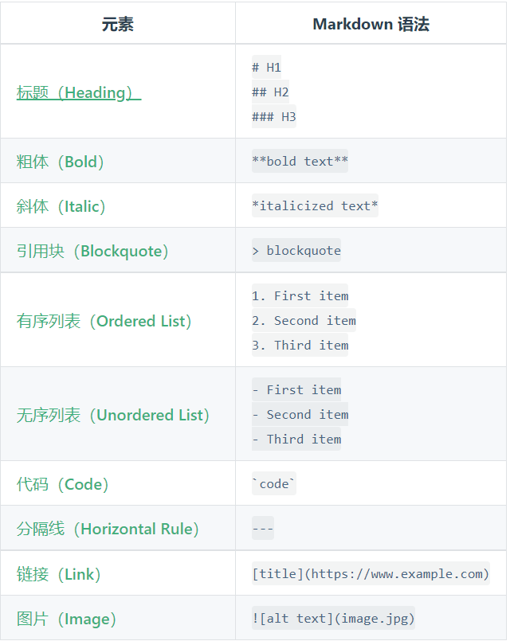

# 速查表



## 标题2

句末两个空格或多个空格回车即可换行  
如上所示

## 字体

**粗体**
*斜体*
***斜体加粗***
~~删除线~~

## 引用

> 引用别人说的话  
>
>> 嵌套引用
>
> ## header

## 引用中添加列表

> 注意事项:  
>
> - 在QT中子线程不允许操作程序中的窗口类型对象,如果操作了程序就会挂
> - 只有主线程才能操作程序中的窗口对象

## 分割线

---

## 图片


## 超链接

<https://www.bing.com/?mkt=zh-cn>  
[点击跳转至Bing](https://www.bing.com/?mkt=zh-cn)

## 列表

1. A
2. B
3. C

- D
- E
- F

## 列表中添加代码块

1. 线程退出

    ```cpp
    //退出线程,停止底层事件循环
    void QThread::exit(int returnCode = 0);//退出线程的工作函数
    void QThread::wait(unsigned long time = ULONG_MAX);//等待任务完成,然后退出线程
    ```

2. 任务处理函数

    ```cpp
        [virtual protected] void QThread::run();//处理任务
    ```

## 表格

|名字|性别|生日|
|--|--|--|
|张三|男|1997.1.1|

## 代码

`hello`  

`0x000 6c49`位于第三行的范围

```java
 public i++;
```

## 公式

- 行内公式: $U_A^B$
- 行间公式:
  - $$U_A^B$$
  - $$
    U_A^B
    $$
