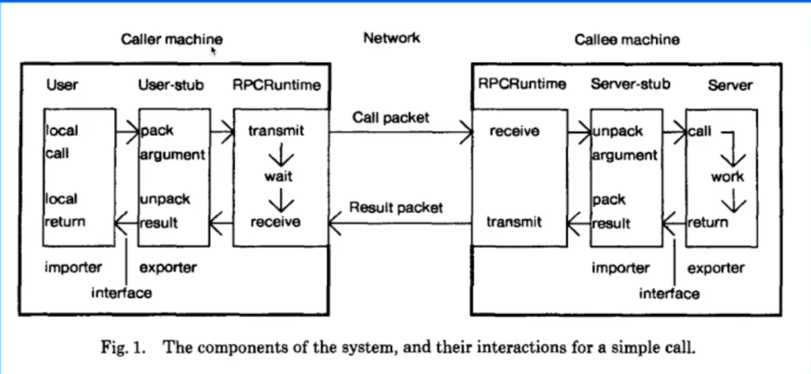
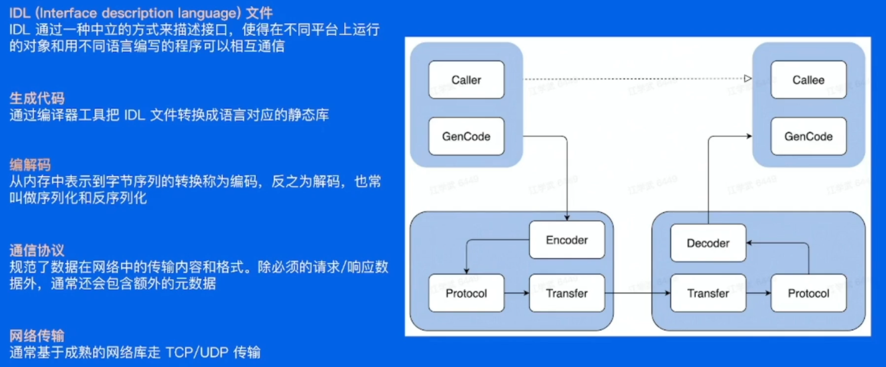

# RPC框架

## 基本概念

RPC：Remote Procedure Calls，远程过程调用

### RPC概念模型

- 由五个模型组成：User、User-Stub、RPC-Runtime、Server-Stub、Server
- 

### 一次RPC完整过程

### RPC的优势与问题

- 优势
  1. 单一职责，有利于分工协作和运维开发
  2. 可扩展性强，资源利用率更优
  3. 故障隔离，服务的整体可靠性更高

- 问题
  1. 服务宕机，对方如何处理？
  2. 在调用过程中发生网络异常，如何保证消息的可达性？
  3. 请求量突增导致服务无法及时处理，有哪些应对措施？

- 采用RPC框架来处理上述问题

> RPC和RPC框架是一回事吗？
> RPC（Remote Procedure Call）是一种允许在不同的计算机上像调用本地函数一样调用远程函数的机制。RPC框架是构建在RPC概念之上的工具、库和协议，用于简化和管理分布式系统之间的通信。

## 需要解决的三个问题

1. 函数映射
2. 数据转换成字节流
3. 网络传输