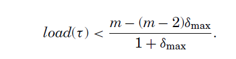

# 实时调度

## 系统模型、术语和符号

### 处理器模型

- **Identical(Homogeneous) multiprocessors(同一多处理器)**
  - Each processor has the same computing capacity

- Uniform multiprocessors(统一多处理器)
  - Different processors have different computing capacities
  - The faster a processor is, the lower the execution time of a task

- Heterogeneous multiprocessors(异质多处理器)
  - Each (task, processor) pair may have a different computational attribute
  - Execution times of a task may vary from processor to processor but there is no well-defined relationship

> 研究中通常认为任务切换、任务迁移等所引起的硬件系统开销已计入任务最坏执行时间或可忽略不计。

### 任务模型

- 任务周期

  - Periodic：由周期性触发的无限连续任务组成
    - Periodic tasksets may be classified as **synchronous** if there is some point in time at which all of the tasks arrive simultaneously , or **asynchronous**, where task arrival times are separated by fixed offsets and there is no simultaneous arrival time.
  - Sporadic（零星，偶发）：连续任务之间存在最小时间间隔T（T时刻不一定触发任务）
  - Aperiodic（无周期）：tasks可以在任意时刻调用job实例，soft deadline

- 参数说明
  - $\tau_i$:task
  - $D_i$:相对截至时间(relative deadline)
  - $C_i$:最坏情况执行时间
  - $T_i$:最小到达间隔时间或周期
  - $u_i$:利用率,由$C_i/T_i$得到
  - $R_i$:task的最坏情况响应时间,是指该task的job从到达到完成执行的最长时间
  - $H(\tau)$:任务集taskset的任务周期的最小公倍数

  - critical instant：The critical instant for a task τi refers to a scenario or pattern of job releases that result in a job of the task exhibiting the worst-case response time.
  - priority level-i busy period：mean an interval of time $[t_1,t_2)$ during which tasks, of priority i or higher, that were released at the start of the busy period at $t_1$ , or during the busy period but prior to its end at $t_2$ , are either executing or ready to execute.(the worst-case response time of a task at priority i must occur within a priority level -i busy pe- riod.)

- deadline

  - Implicit deadline：没有明确的deadline，其值等于Period参数
  - Constraned deadline：受限的deadline，其值小于period参数，对事件要求高
  - Arbitrary deadline：deadline和周期没有关系

### 多处理器系统的调度算法

- 分配
  - No migration:每个任务被分配给一个处理器，不允许迁移。（**partitioned**）
  - Task-level migration（Global）:一个task的job可以在不同的处理器上执行；但是，每个job只能在同一个处理器上执行。
  - Job-level migration（**Global**）:一个job可以迁移到不同的处理器上执行；但是，一个job的并行执行是不允许的。

- 优先权
  - Fixed task priority:每个task都有一个适用于其所有job的固定优先级
  - Fixed job priority:一个job的工作可能有不同的优先级，但每个job有一个静态的优先级。这方面的一个例子是最早期限优先（EDF）调度。
  - Dynamic priority:单个job在不同时间可能有不同的优先级，例如最不宽松（LLF）的调度

- 调度原则
  - Partitioned Scheduler
    - 每个cpu都有各自的调度器实体,任务(task)不可在不同CPU之间迁移(migrate)
  - **Global Scheduler**
    - 一个全局的调度器调度所有的CPU,task可以在CPU之间自由迁移
    > 对全局调度算法的大部分研究都集中在允许任意迁移（Job-level migration）的模型上

- work conserving 和 non-work conserving
  - work conserving（连续工作）：work-conserving scheduler 是指能调度时一定调度。
  - non-work conserving（断续工作）：non-work-conserving scheduler 是指可以调度时，在某些情况下不选择调度
  > Partitioned scheduling algorithms不是work conserving，因为一个处理器可能变得空闲，但不能被分配到不同处理器的就绪任务所使用。

- 是否可抢占
  - **Preemptive**:task可以随时被更高优先级的task抢占
  - Nonpreemptive:一旦任务开始执行，它就不会被抢占，因此会一直执行到完成。
  - Cooperative:任务只能在其执行中定义的调度点被抢占。实际上，任务的执行由一系列不可抢占的部分组成。

### Schedulability, Feasibility, and Optimality

- feasible：如果存在某种调度算法可以调度该系统上任务集可能生成的所有可能的作业序列，而不会错过任何deadline，则称task set对于给定系统是feasible。
  
- optimal：如果调度算法可以调度所有符合task model并且在系统上可行的task set，则称该调度算法相对于系统和task model是optimal
  
- clairvoyant：如果调度算法利用有关未来事件的信息，例如零星任务的精确到达时间或实际执行时间，这些信息在它们发生之前通常是未知的，则称它是clairvoyant。
  
- schedulable：如果一个任务在一个给定的调度算法下的最坏情况下的响应时间小于或等于它的deadline，那么该任务就被称为根据给定的调度算法是schedulable。同样，如果一个任务集的所有任务都是schedulable，那么根据一个给定的调度算法，该任务集被称为schedulable
  
- sufficient、necessary、exact：如果所有根据测试被认为是可调度的任务集事实上是可调度的，那么对于调度算法和系统来说，可调度性测试被称为sufficient。同样地，如果所有根据测试被认为是不可调度的任务集事实上是不可调度的，那么可调度性测试就被称为necessary的。一个既充分又必要的可调度性测试被称为exact。

### processor demand bound function

- processor demand bound function
  - 处理器需求约束函数h(t)对应于在一个时间区间（time interval）[0, t]内可以释放的最大任务执行量，同时也必须在该区间内完成。
  - $h(t) = \sum_{i=1}^{n}{max(0,\lfloor\frac{t-D_i}{T_i}\rfloor+1)C_i}$
  - > 考虑的情况： 最后一个任务的absolute deadline刚好是t
- processor load
  - 处理器需求界限的最大值除以时间间隔的长度
  - $load(\tau)=\underset{\forall t}{max}(\frac{h(t)}{t})$
- a simple necessary condition for taskset feasibility
  - $load(\tau)\le m$ (m为处理器数量)

### 符号表

## 算法实时性能评价指标

### 任务集合CPU利用率界限，Utilization Bound

- 对于隐式截止日期的任务集，最坏情况下的利用率界限是一个有用的性能指标。
- 调度算法A的任务集合CPU利用率界限为正数U，任务集合CPU利用率不超过U的则在算法A中可调度
- 也可直接用作算法可调度性的充分条件
- 一个算法的任务集合CPU利用率界限越大则该算法的实时性能越强

### 加速因子,Speedup Factor(资源增加,Resource Augmentation)

- 一个调度算法A具有加速因子f，则对于任意任务集合，若存在某种调度算法使得该任务集合在速度为a的处理器平台上可调度，则算法A在速度为a*f的处理器平台也能确保该任务集合可调度
- 对于算法A，其加速因子指出该算法在最坏情况下需要在多快的处理器平台上，才能达到与最优算法相同的效率
- 算法加速因子越小其实时性能越强，若其f=1，则表明A为最优算法

### 算法近似率，Approximation Ratio

- 用于比较调度算法A与最优算法性能的一种方式。
- 若存在某种最优算法使得任务集合T恰好在具有M0个处理器核的多处理器上可调度。而算法A则需要至少MA个处理器核，则算法A的近似率为MA/M0
- 任意算法的近似率均不小于1，近似率越小则算法的实时性能越高。当为1 时，算法即为最优
- 如果调度算法有一个有限的近似率，则被称为近似算法。

### 可调度率，Schedulable Ratio

- 对于任意给定的NT个任务集合，若算法A能够成功调度其中的NS个任务集合，则算法A的可调度率（针对NT个任务集合）为NS/NT

### 经验性措施，Empirical Measures

- 由于零星任务集的情况下不知道确切的可行性测试，而对于周期性任务集来说可能是难以解决的，研究人员通常使用经验性措施来比较两个或更多的充分调度性测试/调度算法的相对性能。
- 使用无偏差的任务集生成算法，最好可以生成符合特定参数设置的任务集，这样通过改变任务集参数来检查可调度性测试有效性对每个任务集参数的依赖性。
- 模拟也可以作为对不可调度性的充分测试。

## 一些既定事实

### Optimality

- 即使执行时间是已知的，对到达时间的了解对于Optimality也是必要的
- 通过表明这样的算法也需要clairvoyance，可以推断对于有约束或任意期限的零星任务集，没有最佳的在线算法。
- 对于具有隐性截止日期的周期性任务集来说，最佳算法已经被发现了

### Feasibility（待补全

- 对于implicit-deadline periodic tasksets而言,可行性的充分必要条件是$$ u_{sum} \le m $$
- 对于constrained 和 arbitrary deadline tasksets，上述公式只是必要条件，一个更严格的必要条件是 $$ load(\tau) \le m $$
- $load(\tau)$可以通过使任务的执行时间尽可能在time interval [0, t)内收束为$load^*(\tau)$,同样processor demand bound function也可被收束为$$h^*(t)=h(t)+\sum_{i=1}^{n} max(0,t-max(0,\lfloor\frac{t-D_i}{T_i}\rfloor+1)T_i-D_i+C_i)$$
- hyperperiod (0, $H(τ)$] 可以作为feasibility interval来判断implicit- and constrained-deadline synchronous periodic tasksets的feasibility，对于任何这样的算法，例如全局EDF，可以通过检查产生的调度是否错过了(0, $H(τ)$)中的任何deadline来获得精确的可调度性测试。此外，对于fixed-job-priority的调度，理论上可以通过检查所有N!个可能的工作优先级排序的时间表来实现精确的可行性测试。
- sporadic tasksets scheduling by a fixed-job-priority（FTP也是） algorithm暂时还没有精确的feasibility test
- sufficient feasibility test for global scheduling of general task models：

### Comparability

- 两个算法之间的比较
  - Dominance
  - Equivalence
  - Incomparable

- 不同种类的算法比较
  - 全局（即job级迁移），动态优先级调度 dominates着所有其他类别。
  - 所有三个具有固定任务优先级的类别（分区、任务级迁移和工作级迁移）是incomparable的
  - 所有三个partitioned 类（固定任务优先级、固定工作优先级和动态优先级）在所有三个task-level migration类方面是incomparable的。

### Predictability

- 如果在所有其他参数保持不变的情况下，作业的响应时间不能因为执行时间的减少而增加，那么一种调度算法就被称为predictable。
- 所有优先级驱动的，即fixed-task priority或 fixed-job priority的多处理器系统的抢占式调度算法是predictable.
- 对于任何动态优先级调度算法，在该算法被认为是有用的之前，有必要证明其Predictability

### Sustainability（可持续的）

- 当且仅当符合该模型的任何任务集的可调度性与被以下方法更改的同一任务集的可调度性一致时：(i)减少执行时间，(ii)增加周期或间隔到达时间，以及(iii)增加截止日期，调度算法被称为相对于任务模型是sustainable
- 如果这些更改不能导致先前被测试认为可调度的任务集变得不可调度，则可调度性测试被称为sustainable
- 可调度性测试被称为 self-sustainable，如果这样一个修改的任务集总是被测试认为是可调度的

> self-sustainable和sustainable的区别是啥？

### Anomalies（反常现象）

- 当任务集参数的变化导致对可调度性的反直觉影响时，就会发生调度Anomalies
- Period and Execution Time Anomalies.
- Critical Instant Effect

## 任务调度中的优先级设置

### 任务级固定优先级（Task-level Fixed_priority,TFP)

- RM算法被证明是单处理器隐式截止时间周期任务最优调度算法
- 单调截止时间(Deadline Monotonic, DM)算法被证明为单处理器约束截止时间偶发任务最优调度算法
- 在全局调度下，TFP调度下m核同构多处理器系统的任务集合CPU利用率界限约为 *0.41m*。

### 作业级固定优先级(Job-level Fixed_priority,JFP)

- 在JFP调度算法中，EDF算法的加速因子为1，是单处理实时调度中的最优调度算法
- 在全局JFP调度下m核同构多处理器系统的任务集合CPU利用率界限约为 *(m+1)/2*

### 动态优先级(Dynamic Priority, DP)

- 在DP调度算法中,Pfair以及其扩展算法被证明为多处理器系统隐式截止时间周期任务的最优调度算法——在m核处理器中Pfair算法的任务集合CPU利用率界限为 *m*。
